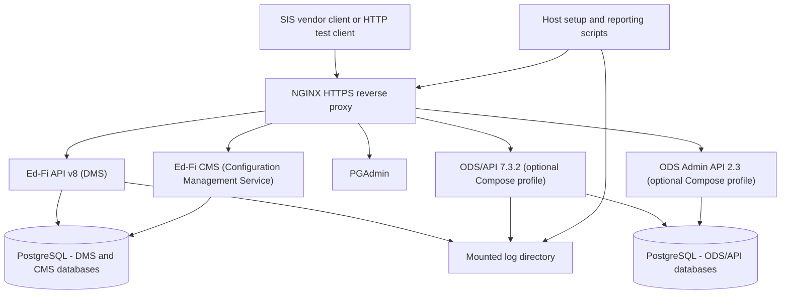

# Product Requirements Document: SIS Pilot Testing Kit

> - **Status:** Draft for review
> - **Product area:** Distributable local testing environment for the SIS
>   integration pilot of Ed-Fi API v8
> - **Repository:** `Ed-Fi-Exchange-OSS/DMS-pilot-testing-kit`

## 1. Product Overview

The SIS Pilot Testing Kit is a distributable Docker Compose package that lets a
Student Information System (SIS) vendor stand up a complete, preconfigured
Ed-Fi API v8 environment — the Data Management Service (DMS) and the Ed-Fi
Configuration Management Service (CMS) — in a non-production environment, obtain
API credentials, submit SIS-generated data, and produce a metrics report about
that run.

The kit exists to serve the pilot described in the SIS pilot test proposal: to
gain confidence in the operational readiness, conformance, and performance of
Ed-Fi API v8 by exercising it with data from independent, production-grade SIS
implementations. The kit is the artifact vendors receive; the pilot is the
program it supports.

The kit optionally provides a comparative Ed-Fi ODS/API 7.3.2 environment in the
same Compose project, so a vendor can run the same data feed against both
platform generations and compare behavior and timing.

Everything in the kit is intended for a local or internal test environment on a
single host. It is not a deployment reference, and it is not a certification
harness.

### 1.1 Strategic Alignment

**Program goals, from the pilot proposal:**

- Demonstrate successful interoperability between SIS vendor products and the
  Ed-Fi API v8 platform.
- Validate the deployment and onboarding experience for external implementers
  before broader market adoption.
- Identify integration, usability, and operational issues early enough to
  influence documentation, deployment automation, and release planning.
- Generate real-world evidence of product readiness.

**Product goals for the kit itself:**

- A vendor engineer reaches a working, credentialed Ed-Fi API v8 endpoint in
  under one hour of setup effort, including reading the documentation.
- Results are comparable across vendors, because every vendor runs the same
  Data Standard version, the same database template, the same claim sets, and
  the same reporting scripts.
- Feedback is cheap to give, because the kit produces the metrics the program
  wants to collect without asking the vendor to build tooling.
- The environment is disposable: a vendor can reset to a known-clean state
  rather than debugging accumulated state.

**Release objective:** a kit good enough to hand to an external vendor who has
no prior Ed-Fi platform operations experience.

### 1.2 Target Users and Personas

- **SIS vendor integration engineer (primary).** Comfortable with Docker and
  HTTP APIs; likely unfamiliar with Ed-Fi platform internals, claim sets, and
  CMS concepts. Wants to point an existing SIS export process at a working
  endpoint with minimal Ed-Fi-specific learning. Succeeds when data is landing,
  failures are explicable, and a run produces a report they can hand to their
  own product owners and to the Ed-Fi Alliance without manual tabulation.
- **Ed-Fi Alliance product manager.** (Stephen Fuqua) Recruits vendors, fields
  feedback, and aggregates results across participants. Succeeds when reports
  from different vendors are structurally comparable and when reported issues
  are reproducible from the vendor's environment description.
- **Ed-Fi Alliance kit maintainer.** (Stephen Fuqua) Updates image tags, claim set
  configuration, Data Standard version, routes, and scripts as the platform
  evolves during the pilot. Succeeds when a change is a configuration edit and a
  clean-volume restart, not a redesign.

### 1.3 Jobs to Be Done / User Journeys

- When I receive the kit, I want a single documented command to bring up a
  working Ed-Fi API v8 environment, so that I can begin integration work the
  same day rather than scheduling an infrastructure task.
- When my SIS needs API credentials, I want a script that registers a vendor
  and application in CMS and prints the resulting key and secret, so that I do
  not have to learn the CMS API before I can authenticate.
- When I submit data, I want each rejected record to produce a diagnosable
  error, so that I can tell whether the fault is in my payload, my mapping, or
  the platform.
- When a feed run finishes, I want a report of error counts, landed record
  counts, and end-to-end duration, so that I can submit results without writing
  my own log analysis.
- When I want to compare platform generations, I want to run the same feed
  against ODS/API 7.3.2 in the same environment, so that differences in
  behavior and timing are attributable to the platform rather than to my setup.
- When my existing client hard-codes the "dataManagementApi" path segment as
  `/data/v3`, I want the kit to accept those paths, so that path migration is
  not a prerequisite to participating in the pilot.
- When my environment becomes stale or corrupted, I want an explicit reset that
  removes persisted data, so that I can return to a known-good baseline.
- When something fails, I want logs, database access, and API metadata
  available locally, so that I can investigate before filing an issue.
- When I finish the pilot, I want to remove the environment completely, so that
  no test infrastructure lingers on my machine or network.

## 2. System Context

The kit is a single Docker Compose project on one host. NGINX is the only
ingress, terminating local HTTPS and routing by path to the platform services.
PostgreSQL is the only database engine. Host scripts handle lifecycle,
credential provisioning, and reporting; they talk to the stack through the same
published interfaces a vendor would use.

### Topology summary

- **Default stack:** NGINX, Ed-Fi API v8 (DMS), Ed-Fi CMS, PostgreSQL, PGAdmin
  (version: a recent snapshot from the `main` branch, post 8.0 release).
- **Optional `odsapi` Compose profile:** Ed-Fi ODS/API 7.3.2 and ODS Admin API
  2.3.2  with their own PostgreSQL service, behind the same NGINX instance on
  distinct routes.
- **Authentication:** the built-in OAuth2 token endpoints of Ed-Fi API v8 and
  ODS/API 7.3.2. No external identity provider participates.
- **Configuration management:** Ed-Fi CMS owns vendor, application, and
  credential records for the v8 stack; Ed-Fi ODS Admin API provides the same
  services for the v7 stack.
- **Data initialization:** both the DMS and ODS/API datastores will be
  initialized using the "minimal template" (descriptors) with no additional
  sample data.

> [!NOTE]
> Consider adding an optional script for populating some education organizations.

## 3. Functional Requirements

Requirements use stable IDs by capability. `SHALL` is mandatory for the pilot
release; `SHOULD` is intended but negotiable; `MAY` is optional.

### 3.1 Environment Lifecycle

- **FR-LIFE-1:** The kit SHALL provide a single documented startup command that
  brings up the default v8 stack with no prior Ed-Fi-specific configuration by the
  vendor beyond copying and editing an example environment file.
- **FR-LIFE-2:** The kit SHALL provide equivalent PowerShell and Bash lifecycle
  scripts, so that Windows, macOS, and Linux hosts are first-class.
- **FR-LIFE-3:** PowerShell and Bash scripts SHALL accept the same parameters
  and produce the same observable outcomes; documentation SHALL describe one
  workflow rather than two divergent workflows.
- **FR-LIFE-4:** Startup SHALL be idempotent: running it against an already
  running environment SHALL not destroy data or produce a failure state.
- **FR-LIFE-5:** The kit SHALL provide a stop command that stops the stack and
  preserves persisted data by default.
- **FR-LIFE-6:** The kit SHALL provide an explicit, clearly labelled destructive
  reset that removes persisted volumes and returns the environment to its
  initial state.
- **FR-LIFE-7:** Startup SHALL NOT report success until the API is ready to
  accept authenticated requests; it SHALL wait on service health rather than on
  container creation.
- **FR-LIFE-8:** On success, startup SHALL print the local URLs and the next
  action the vendor should take.
- **FR-LIFE-9:** On failure, startup SHALL return a non-zero exit status and
  SHALL identify which service failed and where to find its logs.
- **FR-LIFE-10:** All services SHALL be selected through Compose profiles such
  that the default startup does not start the optional comparative stack.

### 3.2 Platform Composition and Data Standard

- **FR-PLAT-1:** The default stack SHALL provide Ed-Fi API v8 (DMS) and Ed-Fi
  CMS.
- **FR-PLAT-2:** The stack SHALL be configured for Ed-Fi Data Standard 5.2.
- **FR-PLAT-3:** The database SHALL be initialized with the minimal template
  equivalent — required descriptors and platform structures only, with no
  additional sample data.
- **FR-PLAT-4:** PostgreSQL SHALL be the only supported database engine.
- **FR-PLAT-5:** Every service image SHALL be referenced by a pinned, published
  tag supplied through environment configuration, so that all vendors in a given
  pilot round run the same versions.
- **FR-PLAT-6:** The kit SHALL keep the service inventory to the minimum needed
  to satisfy the feature requirements in section 3.3; components that exist only
  to support unrelated Ed-Fi products SHALL be excluded.

### 3.3 API Feature Availability

The pilot performs conformance testing, so the surface under test must be
complete and identical across vendors.

- **FR-FEAT-1:** The stack SHALL expose all Data Standard 5.2 endpoints served
  the Resources API and the Descriptors API.
- **FR-FEAT-2:** THe stack SHALL expose the Discovery API (root URL).
- **FR-FEAT-3:** The stack SHALL expose platform metadata: XSD, OpenAPI
  specification documents, and a browsable Swagger UI.
- **FR-FEAT-4:** The stack SHALL enable change queries.
- **FR-FEAT-5:** The stack SHALL enable Profiles.
- **FR-FEAT-6:** The stack SHALL enable ETag support.
- **FR-FEAT-7:** The stack SHALL enable limit/offset paging.
- **FR-FEAT-8:** The stack SHALL use the standard claim sets, unmodified, so
  that authorization behavior observed by a vendor matches the documented
  default.
- **FR-FEAT-9:** Any feature in this section that cannot be enabled in the
  pilot release SHALL be recorded as a known limitation in the kit's
  documentation rather than silently omitted.

### 3.4 Credential Provisioning

- **FR-CRED-1:** The kit SHALL provide scripts that register a CMS client and
  generate SIS vendor API credentials without the vendor calling the CMS API
  directly.
- **FR-CRED-2:** Credential provisioning SHALL print the generated key and
  secret and SHALL state that they are non-recoverable if the script does not
  persist them.
- **FR-CRED-3:** Credential provisioning SHALL be re-runnable to create
  additional credentials, and SHALL NOT silently overwrite an existing vendor or
  application registration.
- **FR-CRED-4:** Provisioning SHALL associate the generated credential with the
  standard claim set and with the education organization identifiers required
  for the vendor's data, and the documentation SHALL explain how to change that
  association.
- **FR-CRED-5:** The kit SHALL document how to obtain an access token from the
  built-in OAuth2 token endpoint using the generated credential.
- **FR-CRED-6:** Provisioning scripts SHALL fail with an actionable message when
  CMS is not yet reachable or not yet initialized.

### 3.5 Routing and Request Handling

- **FR-ROUTE-1:** NGINX SHALL be the single ingress for all vendor-facing
  services and SHALL route by configurable path prefix.
- **FR-ROUTE-2:** NGINX SHALL terminate HTTPS using mounted certificate files
  and SHALL redirect HTTP requests to HTTPS.
- **FR-ROUTE-3:** The kit SHALL provide a script that generates a self-signed
  certificate for local use, and documentation SHALL explain how to trust it or
  how to bypass verification in typical .NET, JavaScript, and Python ecosystems.
- **FR-ROUTE-4:** Proxied requests SHALL carry the forwarded protocol, host,
  port, and client address headers the downstream services need to generate
  correct absolute URLs in Discovery and metadata responses.
- **FR-ROUTE-5:** NGINX SHALL rewrite the legacy `/data/v3` path prefix to the
  corresponding Ed-Fi API v8 resource paths, and this rewrite SHALL be enabled
  by default.
- **FR-ROUTE-6:** The `/data/v3` rewrite SHALL be disableable through a single
  documented configuration setting, so that a vendor can verify their client
  against native v8 paths.
- **FR-ROUTE-7:** Documentation SHALL state plainly that `/data/v3` is a
  compatibility affordance for the pilot and not a supported Ed-Fi API v8 path,
  and SHALL ask vendors to report whether they relied on it.
- **FR-ROUTE-8:** Rate limiting SHOULD be available and SHALL be disabled by
  default; limits SHALL be configurable without editing the NGINX template.
- **FR-ROUTE-9:** When a downstream service is unavailable, NGINX SHOULD return
  a clear HTTP 503 rather than an opaque proxy error.

### 3.6 Comparative ODS/API Testing

- **FR-COMP-1:** The kit SHALL provide an Ed-Fi ODS/API 7.3.2 environment in the
  same Compose project, selected by an opt-in `odsapi` Compose profile. This
  environment SHALL include ODS Admin API 2.3.2 as well.
- **FR-COMP-2:** The comparative stack SHALL be reachable through the same
  NGINX instance on a distinct, configurable route, so that the only difference
  a vendor's client sees is the base URL.
- **FR-COMP-3:** The comparative stack SHALL be configured for Data Standard 5.2
  and initialized from the minimal template.
- **FR-COMP-4:** The comparative stack SHALL use its own database service and
  its own persisted volume, so that resetting one platform does not affect the
  other.
- **FR-COMP-5:** The comparative stack SHALL instrument ODS Admin API
  credentialing to meet the same requirements expressed in **FR-CRED-\***.
- **FR-COMP-6:** Metrics and reporting SHALL treat the two platforms
  symmetrically, producing comparable reports for each.
- **FR-COMP-7:** Documentation SHALL state that comparative testing is optional
  and SHALL describe its additional host resource cost.

### 3.7 Logging

- **FR-LOG-1:** Logging SHALL be configured deliberately to capture what the
  program's evaluation criteria require: request outcomes, error detail, and
  timing.
- **FR-LOG-2:** Log levels SHALL be configurable through environment
  configuration.
- **FR-LOG-3:** API and NGINX logs SHALL be written to a configurable
  host-mounted directory so that they survive container removal and can be read
  by the reporting scripts.
- **FR-LOG-4:** Logs SHALL be in a machine-parseable format sufficient for
  section 3.8 without heuristic text scraping.
- **FR-LOG-5:** Logs SHALL include a correlation identifier per request where
  the platform supports one, so that a failed record can be traced across
  services.
- **FR-LOG-6:** Documentation SHALL state what the logs capture, so that a
  vendor can make an informed decision before sending data through the
  environment and before sharing logs with the Alliance.

### 3.8 Metrics and Reporting

- **FR-MET-1:** The kit SHALL provide scripted log parsing that produces a run
  report without manual tabulation.
- **FR-MET-2:** The report SHALL include the error count produced during
  processing.
- **FR-MET-3:** The report SHALL include the count of successfully processed or
  landed records.
- **FR-MET-4:** The report SHALL include end-to-end processing duration,
  measured from the first inbound request to the completion of data
  transmission.
- **FR-MET-5:** The report SHOULD break error counts down by HTTP status and by
  resource, so that a vendor can find their largest problem first.
- **FR-MET-6:** The report SHALL record the environment's identifying
  configuration — image tags, Data Standard version, profile selection, and
  whether the `/data/v3` rewrite and rate limiting were active — so that results
  are interpretable months later.
- **FR-MET-7:** The report SHALL be emitted as a local file in both a
  human-readable and a machine-readable form, in a documented location.
- **FR-MET-8:** Reporting SHALL be runnable repeatedly against the same logs
  without altering them.
- **FR-MET-9:** The kit SHALL NOT transmit results, logs, or telemetry anywhere.
  Submission is a deliberate vendor action.
- **FR-MET-10:** Documentation SHALL tell the vendor how to submit the report
  and SHALL ask them to review its contents before sharing.

### 3.9 Smoke Test and Request Examples

- **FR-TEST-1:** The kit SHALL provide a `.http` request file that demonstrates
  the core interactions: token acquisition, a Discovery API call, a descriptor
  read, a resource write, a resource read-back, and a paged query.
- **FR-TEST-2:** The request file SHALL be usable immediately after startup and
  credential provisioning, with variables rather than hard-coded secrets.
- **FR-TEST-3:** The request file SHALL include at least one deliberately
  invalid request, so that a vendor sees the platform's error shape before
  encountering it at volume.
- **FR-TEST-4:** The kit SHOULD provide a scripted smoke test that exercises the
  same path non-interactively and returns a non-zero exit status on failure, so
  that a vendor can confirm the environment before pointing their SIS at it.
- **FR-TEST-5:** The request file SHOULD include equivalent examples against the
  comparative ODS/API route when that profile is enabled.

### 3.10 Documentation

- **FR-DOC-1:** The kit SHALL document prerequisites — Docker, host resources,
  available ports, and certificate generation — before any setup step.
- **FR-DOC-2:** The kit SHALL document the setup path as an ordered, verifiable
  sequence with an expected result after each step.
- **FR-DOC-3:** Documentation SHALL be written for a reader with no prior Ed-Fi
  platform operations experience, and SHALL define Ed-Fi-specific terms at first
  use or link to their definitions.
- **FR-DOC-4:** Documentation SHALL list default local URLs and default
  credentials, and SHALL state that they are local-development values only.
- **FR-DOC-5:** Documentation SHALL include a troubleshooting section covering
  port conflicts, certificate trust, startup timeouts, and volume reset.
- **FR-DOC-6:** Documentation SHALL state what feedback the pilot wants and how
  to provide it.
- **FR-DOC-7:** Documentation SHALL be verified by following it on a clean host
  before the kit is distributed to vendors.

## 4. Non-Functional Requirements

### 4.1 Usability and Onboarding

- **NFR-USE-1:** A vendor engineer meeting the documented prerequisites SHALL
  reach a credentialed, verified API endpoint in under one hour of effort,
  including reading the documentation. This is the kit's primary acceptance
  measure.
- **NFR-USE-2:** The default startup path SHALL require no manual edits to
  Compose files, NGINX templates, or service configuration.
- **NFR-USE-3:** Configuration SHALL be concentrated in a single example
  environment file with commented, sensible defaults.
- **NFR-USE-4:** Error messages from the kit's own scripts SHALL name the
  probable cause and the next action.

### 4.2 Portability

- **NFR-PORT-1:** The kit SHALL run on Docker Desktop on Windows and macOS and
  on Docker Engine on Linux, using only Compose features available in current
  Docker Compose v2.
- **NFR-PORT-2:** No step SHALL require a Windows-only or Unix-only tool; where
  a helper is needed, both PowerShell and Bash equivalents SHALL exist.
- **NFR-PORT-3:** Host resource requirements SHALL be stated for both the
  default stack and the stack with the comparative profile enabled.
- **NFR-PORT-4:** Host port bindings SHALL be configurable, since vendor
  machines may already use the defaults.

### 4.3 Security

- **NFR-SEC-1:** The stack SHALL use HTTPS at the NGINX boundary with a locally
  generated certificate, and documentation SHALL clearly distinguish this
  self-signed local arrangement from production TLS practice.
- **NFR-SEC-2:** Authentication SHALL use the built-in OAuth2 servers of Ed-Fi
  API v8 and ODS/API 7.3.2. No external identity provider SHALL be required.
- **NFR-SEC-3:** Secrets, keys, and database passwords SHALL be supplied through
  local environment configuration; the repository SHALL NOT contain values
  presented as production-suitable.
- **NFR-SEC-4:** Default credentials in the example environment file SHALL be
  labelled as local-development-only, and documentation SHALL instruct vendors
  to change them if the environment is reachable beyond their host.
- **NFR-SEC-5:** By default the stack SHALL bind only to the local host, and
  documentation SHALL state what changes if a vendor exposes it on their
  network.
- **NFR-SEC-6:** The kit SHALL make no outbound network calls other than
  pulling images and whatever the platform services require to start.
- **NFR-SEC-7:** The repository SHALL retain its existing supply-chain
  workflows, and images SHALL be pulled from official Ed-Fi Alliance published
  locations.

### 4.4 Privacy and Data Handling

- **NFR-PRIV-1:** Documentation SHALL instruct vendors to submit synthetic or
  de-identified data and SHALL state that the kit is not an appropriate
  destination for real student records.
- **NFR-PRIV-2:** Documentation SHALL warn that logs and reports may contain
  payload fragments and identifiers, and SHALL tell vendors to review artifacts
  before sharing them outside their organization.
- **NFR-PRIV-3:** The destructive reset SHALL remove persisted database
  contents, and documentation SHALL state how to remove mounted logs and
  reports as well.

### 4.5 Reliability and Reproducibility

- **NFR-REL-1:** Services SHALL declare health checks, and startup ordering
  SHALL use health conditions rather than fixed delays.
- **NFR-REL-2:** Health-check retries and start periods SHALL be bounded so
  that a broken environment fails visibly instead of hanging.
- **NFR-REL-3:** A given pinned configuration SHALL produce the same environment
  on every vendor's host; no step SHALL depend on a floating `latest` tag.
- **NFR-REL-4:** Persisted volumes SHALL survive ordinary restarts, and data
  loss SHALL only occur through the explicit destructive reset.
- **NFR-REL-5:** A clean-volume startup SHALL be the supported recovery path for
  a corrupted environment.

### 4.6 Performance

- **NFR-PERF-1:** The kit SHALL NOT introduce artificial throughput limits in
  its default configuration; rate limiting is opt-in per FR-ROUTE-8.
- **NFR-PERF-2:** Database connection pooling SHALL be configurable, so that a
  vendor testing at volume is not bottlenecked by a default the kit chose.
- **NFR-PERF-3:** The kit SHALL NOT claim platform performance targets. It
  measures; the program interprets. Any timing figure the kit reports SHALL be
  accompanied by the environment configuration that produced it.
- **NFR-PERF-4:** Documentation SHALL note that a single-host Compose
  environment is not a performance-representative deployment, so that
  comparative timings are not over-read.

### 4.7 Observability

- **NFR-OBS-1:** Every service's logs SHALL be reachable either through the
  mounted log directory or through `docker logs`, and documentation SHALL say
  which applies to each.
- **NFR-OBS-2:** PGAdmin SHALL be provided with preconfigured server
  definitions for the stack's PostgreSQL services.
- **NFR-OBS-3:** Swagger UI and OpenAPI documents SHALL be reachable through the
  documented local routes.

### 4.8 Maintainability and SDLC

- **NFR-MAINT-1:** Image tags, route names, ports, credentials, log levels, and
  feature switches SHALL be configurable through environment variables without
  duplicating the Compose topology.
- **NFR-MAINT-2:** Adding or advancing a platform version SHOULD be a
  configuration change, not a structural change.
- **NFR-MAINT-3:** Changes to the kit SHALL be verified by a clean-volume
  startup and a smoke-test pass before release to vendors.
- **NFR-MAINT-4:** All contributed files SHALL carry the repository's Apache-2.0
  license header convention where the file type supports comments.
- **NFR-MAINT-5:** The kit SHOULD be exercised in CI to the extent the images
  and host resources allow, so that a broken kit is caught before a vendor finds
  it.

## 5. System Architecture

| Component | Responsibility | Runtime boundary | Configuration/data ownership |
| --- | --- | --- | --- |
| Lifecycle scripts (PowerShell + Bash) | Start, stop, reset, wait for health, print URLs and next steps | Host machine | `.env`, Docker CLI, Compose profiles |
| Compose project | Define services, profiles, health checks, volumes, network | Docker Compose | YAML plus environment substitution |
| NGINX | HTTPS termination, path routing, `/data/v3` rewrite, optional rate limiting | Container, host HTTPS port | Config template, generated certificate files |
| Ed-Fi API v8 (DMS) | System under test: Discovery, Resources, Descriptors, metadata, change queries, Profiles, ETags, paging, built-in OAuth2 | Container | Platform settings, claim set configuration, DS 5.2 artifacts |
| Ed-Fi CMS | Vendor, application, and credential management for the v8 stack | Container | CMS database schema and configuration |
| PostgreSQL (v8) | Persistence for DMS and CMS | Container | Credentials, named volume, minimal initialization |
| ODS/API 7.3.2 | Optional comparative system under test, with built-in OAuth2 | Container, `odsapi` profile | Image tag, route, credentials |
| Ed-Fi ODS Admin API | Vendor, application, and credential management for the v7 stack | Container | CMS database schema and configuration |
| PostgreSQL (ODS/API) | Persistence for the comparative stack | Container, `odsapi` profile | Minimal template initialization, separate volume |
| PGAdmin | Database inspection for troubleshooting | Container | Preconfigured server definitions, named volume |
| Credential provisioning scripts | Register clients and mint vendor API credentials for both platforms | Host machine | CMS API and ODS/API configuration surface |
| Log mount | Durable location for API and proxy logs | Host filesystem | Configurable host path |
| Reporting scripts | Parse logs into error counts, landed counts, duration, and environment metadata | Host machine | Log mount, report output path |
| Request examples and smoke test | Demonstrate and verify core interactions | Host machine / HTTP client | `.http` file variables |

## 6. Out of Scope and Known Limitations

### Explicitly out of scope

- Microsoft SQL Server. PostgreSQL is the only supported engine, and no SQL
  Server variant is planned for this kit.
- Ed-Fi Admin App. Configuration is handled by Ed-Fi CMS or Ed-Fi ODS Admin API;
  no administrative UI is provided.
- Keycloak or any external identity provider. Both platforms' built-in OAuth2
  servers are sufficient for the pilot.
- Multi-tenancy and district-specific topologies. The kit provides one
  single-tenant environment per platform.
- Sample and populated data sets. The minimal template is the only supported
  starting point, because the pilot's data comes from the vendor.
- Data Standard versions other than 5.2, and Ed-Fi extensions or TPDM.
- Production deployment guidance, high availability, backup and retention,
  secret management, certificate authority management, and internet-facing
  hardening.
- Kubernetes, Helm, and Podman support.
- Certification or conformance attestation. The pilot gathers evidence; it does
  not issue a certification result.
- Ed-Fi Alliance-side aggregation tooling. The kit produces a local report; what
  the Alliance does with submitted reports is a separate concern.
- Automated telemetry or result upload. Submission is a manual vendor action.

### Known limitations and risks

- **Self-signed HTTPS is friction against the one-hour goal.** Certificate
  generation and client trust are the most likely place a vendor stalls.
  Mitigation: a generation script (FR-ROUTE-3) and explicit troubleshooting
  guidance (FR-DOC-5). This trade-off was accepted deliberately in favor of a
  more production-like transport.
- **The `/data/v3` rewrite being on by default hides migration readiness.** A
  vendor can complete the pilot without ever exercising native v8 paths, which
  is exactly one of the things the program wants to learn. Mitigation:
  FR-ROUTE-6 makes it disableable, FR-ROUTE-7 asks vendors to disclose reliance
  on it, and FR-MET-6 records its state in the report. This remains a real
  measurement gap.
- **Running both platforms in one Compose project raises the host resource
  floor** even though the comparative profile is opt-in, because the two share
  one NGINX and one project lifecycle. NFR-PORT-3 requires the cost to be
  stated.
- **Single-host Compose timings are not performance data.** Comparative
  durations are indicative only; NFR-PERF-4 requires that caveat in writing.
- **The kit cannot distinguish vendor data-quality problems from platform
  defects.** Error counts will include both, and triage remains a human task.
- **Default credentials and a self-signed certificate in a public repository**
  are appropriate only for a local environment; a vendor who exposes the stack
  on a network inherits that risk (NFR-SEC-4, NFR-SEC-5).

## 7. Open Questions and Decision Log

### Open questions

- Are participating SIS vendors prepared for the Ed-Fi API v8 resource paths, or
  is `/data/v3` compatibility load-bearing for most of them? This is a question
  the pilot should answer, not one the kit should assume.
- Which claim set and which education organization identifiers should a
  generated vendor credential receive by default, given that the database starts
  from the minimal template and contains no local education agency or school?
  Does the kit need to seed a minimal education organization before a vendor's
  first write can succeed?
- What is the report's machine-readable format and schema, and does the Alliance
  need it stable enough to aggregate automatically across vendors?
- What is the submission channel for reports and feedback — GitHub issues in
  this repository, a form, or direct contact with the pilot coordinator?
- What are the minimum host resources for each profile, and should the kit
  refuse to start or warn when the host is below them?
- How are corrections distributed mid-pilot if a defect is found in the kit
  itself, and how is a vendor's report tied to the kit version that produced it?
- Does the pilot need the vendor to record a host hardware profile alongside the
  report for comparative timings to mean anything?

## 8. Glossary

- **Ed-Fi API v8:** The current generation of the Ed-Fi API specification and
  platform, implemented by the Data Management Service. Referred to in this
  repository as "DMS".
- **DMS (Data Management Service):** The service implementing Ed-Fi API v8 and
  the primary system under test in this pilot.
- **CMS (Configuration Management Service):** The Ed-Fi Management API service
  that manages vendors, applications, and API credentials for the Ed-Fi API v8
  platform.
- **ODS/API:** The legacy Ed-Fi platform generation, paired with an Operational
  Data Store database. Version 7.3.2 is the optional comparative target here.
- **ODS Admin API:** The legacy Ed-Fi Management API service that manages
  vendors, applications, and API credentials for the Ed-Fi ODS/API platform.
- **Data Standard 5.2:** The Ed-Fi Unifying Data Model version the pilot
  environment is configured for; it determines the available resources,
  descriptors, and schemas.
- **Minimal template:** A database starting point containing only required
  structures and descriptors, with no sample student or organization data.
- **Claim set:** The named authorization configuration that determines which
  resources and actions a credential may exercise.
- **Descriptor:** An Ed-Fi enumerated value set exposed through its own API
  endpoints.
- **Discovery API:** The root endpoint that advertises a platform instance's
  version, data models, and dependent endpoint URLs.
- **Change queries:** The Ed-Fi capability allowing a client to retrieve
  records changed since a given change version.
- **Profiles:** The Ed-Fi capability constraining the fields a given client may
  read or write for a resource.
- **ETag:** An HTTP entity tag used for optimistic concurrency and conditional
  requests.
- **Vendor / application:** CMS records representing an integrating
  organization and one of its integrating systems; credentials are issued
  against an application.
- **Compose profile:** The Docker Compose mechanism used here to make the
  comparative ODS/API stack opt-in.
- **SIS (Student Information System):** The vendor product generating the data
  submitted during the pilot.
- **The kit:** This repository's distributable Compose environment, scripts,
  request examples, and documentation.
