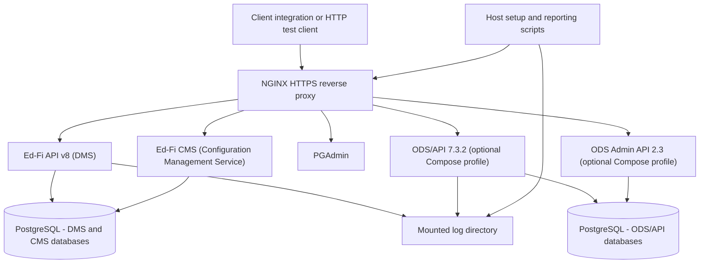

# Product Requirements Document: Client Integration Pilot Testing Kit

> - **Status:** Draft for review
> - **Product area:** Distributable local testing environment for the client
>   integration pilot of Ed-Fi API v8
> - **Repository:** `Ed-Fi-Exchange-OSS/DMS-pilot-testing-kit`

## 1. Product Overview

The Client Integration Pilot Testing Kit is a distributable Docker Compose
package that lets a client integrator stand up a complete, preconfigured Ed-Fi
API v8 environment — the Data Management Service (DMS) and the Ed-Fi
Configuration Management Service (CMS) — in a non-production environment,
obtain API credentials, exercise the API with their own client, and produce a
metrics report about that run.

A *client integration* is any system that reads from or writes to an Ed-Fi API.
The pilot targets three representative shapes, and the kit must serve all three:

- **Student Information System (SIS) integrations.** Write-oriented. Submit
  core enrollment, demographic, staff, schedule, and calendar data, typically
  as a large initial load followed by incremental updates.
- **Assessment provider integrations.** Write-oriented, with a narrower
  resource footprint. Submit assessment metadata and student assessment
  results, and depend on resolving references to student and education
  organization records they did not create.
- **Downstream data warehouse and analytics loads.** Read-oriented. Extract
  data out of the API — full paged extracts and incremental change-query
  extracts — for loading into a warehouse or reporting platform. These clients
  need data to already exist in the environment before they can be tested at
  all.

The kit exists to serve the pilot described in the client integration pilot
test proposal: to gain confidence in the operational readiness, conformance,
and performance of Ed-Fi API v8 by exercising it with independent,
production-grade client implementations. The kit is the artifact participants
receive; the pilot is the program it supports.

The kit optionally provides a comparative Ed-Fi ODS/API 7.3.2 environment in the
same Compose project, so a participant can run the same exercise against both
platform generations and compare behavior and timing.

Everything in the kit is intended for a local or internal test environment on a
single host. It is not a deployment reference, and it is not a certification
harness.

### 1.1 Strategic Alignment

**Program goals, from the pilot proposal:**

- Demonstrate successful interoperability between third-party client
  integrations — SIS, assessment, and downstream analytics — and the Ed-Fi API
  v8 platform.
- Validate the deployment and onboarding experience for external implementers
  before broader market adoption.
- Identify integration, usability, and operational issues early enough to
  influence documentation, deployment automation, and release planning.
- Generate real-world evidence of product readiness.

**Product goals for the kit itself:**

- A participant's engineer reaches a working, credentialed Ed-Fi API v8
  endpoint in under one hour of setup effort, including reading the
  documentation.
- Results are comparable across participants, because every participant runs
  the same Data Standard version, the same reporting scripts, one of only two
  published database templates, and the same claim set as every other
  participant of their integration shape.
- Feedback is cheap to give, because the kit produces the metrics the program
  wants to collect without asking the participant to build tooling.
- The environment is disposable: a participant can reset to a known-clean state
  rather than debugging accumulated state.

**Release objective:** a kit good enough to hand to an external participant who
has no prior Ed-Fi platform operations experience, whichever of the three
integration shapes they are building.

### 1.2 Target Users and Personas

- **Client integration engineer (primary).** Comfortable with Docker and HTTP
  APIs; likely unfamiliar with Ed-Fi platform internals, claim sets, and CMS
  concepts. Wants to point an existing export or extract process at a working
  endpoint with minimal Ed-Fi-specific learning. Succeeds when data is moving
  in the expected direction, failures are explicable, and a run produces a
  report they can hand to their own product owners and to the Ed-Fi Alliance
  without manual tabulation. Three variations matter:
  - The *SIS engineer* and the *assessment engineer* both need an environment
    they can write into, and care most about reference resolution and
    validation errors.
  - The *warehouse or analytics engineer* needs an environment that already
    contains data, and cares most about paging, change queries, and extract
    completeness. For this engineer, an empty database is not a usable test
    target.
- **Ed-Fi Alliance product manager.** (Stephen Fuqua) Recruits participants,
  fields feedback, and aggregates results. Succeeds when reports from different
  participants are structurally comparable — including across integration
  shapes — and when reported issues are reproducible from the participant's
  environment description.
- **Ed-Fi Alliance kit maintainer.** (Stephen Fuqua) Updates image tags, claim set
  configuration, Data Standard version, routes, and scripts as the platform
  evolves during the pilot. Succeeds when a change is a configuration edit and a
  clean-volume restart, not a redesign.

### 1.3 Jobs to Be Done / User Journeys

- When I receive the kit, I want a single documented command to bring up a
  working Ed-Fi API v8 environment, so that I can begin integration work the
  same day rather than scheduling an infrastructure task.
- When my client needs API credentials, I want a script that registers a vendor
  and application in CMS and prints the resulting key and secret, so that I do
  not have to learn the CMS API before I can authenticate.
- When I submit data, I want each rejected record to produce a diagnosable
  error, so that I can tell whether the fault is in my payload, my mapping, or
  the platform.
- When my integration writes assessment results that reference students and
  education organizations I did not create, I want an environment that already
  contains those records, so that I am testing my integration rather than
  fighting reference errors.
- When my integration reads data out for a warehouse, I want the environment
  pre-loaded with a realistic sample data set, so that I can exercise full
  extracts, paging, and change queries without first building a data loader.
- When I choose a starting data set, I want a single documented switch between
  the minimal and populated templates, so that I do not have to assemble test
  data myself.
- When startup finishes, I want a state agency, a district, and an elementary,
  middle, and high school to already exist, so that my client credentials can
  be scoped to a real education organization and my first write has somewhere
  to land.
- When my own data needs organizations the kit did not create, I want a
  ready-made set of requests I can copy and adjust, so that adding a second
  district or another school does not mean writing payloads from the
  specification.
- When a feed run finishes, I want a report of error counts, landed record
  counts, and end-to-end duration, so that I can submit results without writing
  my own log analysis.
- When I want to compare platform generations, I want to run the same feed
  against ODS/API 7.3.2 in the same environment, so that differences in
  behavior and timing are attributable to the platform rather than to my setup.
- When my existing client hard-codes the "dataManagementApi" path segment as
  `/data/v3`, I want the kit to accept those paths, so that path migration is
  not a prerequisite to participating in the pilot.
- When my environment becomes stale or corrupted, I want an explicit reset that
  removes persisted data, so that I can return to a known-good baseline.
- When something fails, I want logs, database access, and API metadata
  available locally, so that I can investigate before filing an issue.
- When I finish the pilot, I want to remove the environment completely, so that
  no test infrastructure lingers on my machine or network.

## 2. System Context

The kit is a single Docker Compose project on one host. NGINX is the only
ingress, terminating local HTTPS and routing by path to the platform services.
PostgreSQL is the only database engine. Host scripts handle lifecycle,
credential provisioning, and reporting; they talk to the stack through the same
published interfaces a participant's client would use.

### Topology summary

- **Default stack:** NGINX, Ed-Fi API v8 (DMS), Ed-Fi CMS, PostgreSQL, PGAdmin
  (version: a recent snapshot from the `main` branch, post 8.0 release).
- **Optional `odsapi` Compose profile:** Ed-Fi ODS/API 7.3.2 and ODS Admin API
  2.3.2  with their own PostgreSQL service, behind the same NGINX instance on
  distinct routes.
- **Authentication:** the built-in OAuth2 token endpoints of Ed-Fi API v8 and
  ODS/API 7.3.2. No external identity provider participates.
- **Configuration management:** Ed-Fi CMS owns vendor, application, and
  credential records for the v8 stack; Ed-Fi ODS Admin API provides the same
  services for the v7 stack.
- **Data initialization:** both the DMS and ODS/API datastores are initialized
  from one of two templates, chosen before first startup. The "minimal
  template" (descriptors only, no sample data) is the default and suits
  write-oriented SIS and assessment integrations. The "populated template" adds
  the Ed-Fi sample data set and exists for downstream data warehouse and
  analytics integrations, which need data present before they can extract
  anything.

- **Bootstrapping:** because an integration credential must be scoped to an
  education organization, and the minimal template contains none, startup
  creates a broad-access bootstrap credential and uses it to create a baseline
  SEA / LEA / school hierarchy. See sections 3.5 and 3.13.

## 3. Functional Requirements

Requirements use stable IDs by capability. `SHALL` is mandatory for the pilot
release; `SHOULD` is intended but negotiable; `MAY` is optional.

### 3.1 Environment Lifecycle

- **FR-LIFE-1:** The kit SHALL provide a single documented startup command that
  brings up the default v8 stack with no prior Ed-Fi-specific configuration by
  the participant beyond copying and editing an example environment file.
- **FR-LIFE-2:** The kit SHALL provide equivalent PowerShell and Bash lifecycle
  scripts, so that Windows, macOS, and Linux hosts are first-class.
- **FR-LIFE-3:** PowerShell and Bash scripts SHALL accept the same parameters
  and produce the same observable outcomes; documentation SHALL describe one
  workflow rather than two divergent workflows.
- **FR-LIFE-4:** Startup SHALL be idempotent: running it against an already
  running environment SHALL not destroy data or produce a failure state.
- **FR-LIFE-5:** The kit SHALL provide a stop command that stops the stack and
  preserves persisted data by default.
- **FR-LIFE-6:** The kit SHALL provide an explicit, clearly labelled destructive
  reset that removes persisted volumes and returns the environment to its
  initial state.
- **FR-LIFE-7:** Startup SHALL NOT report success until the API is ready to
  accept authenticated requests and bootstrapping per section 3.5 has
  completed; it SHALL wait on service health rather than on container creation.
- **FR-LIFE-8:** On success, startup SHALL print the local URLs, the active
  template selection, and the next action the participant should take.
- **FR-LIFE-9:** On failure, startup SHALL return a non-zero exit status and
  SHALL identify which service failed and where to find its logs.
- **FR-LIFE-10:** All services SHALL be selected through Compose profiles such
  that the default startup does not start the optional comparative stack.

### 3.2 Platform Composition and Data Standard

- **FR-PLAT-1:** The default stack SHALL provide Ed-Fi API v8 (DMS) and Ed-Fi
  CMS.
- **FR-PLAT-2:** The stack SHALL be configured for Ed-Fi Data Standard 5.2.
- **FR-PLAT-3:** The database SHALL be initialized with the minimal template
  equivalent by default — required descriptors and platform structures only,
  with no additional sample data.
- **FR-PLAT-4:** PostgreSQL SHALL be the only supported database engine.
- **FR-PLAT-5:** Every service image SHALL be referenced by a pinned, published
  tag supplied through environment configuration, so that all participants in a
  given pilot round run the same versions.
- **FR-PLAT-6:** The kit SHALL keep the service inventory to the minimum needed
  to satisfy the feature requirements in section 3.4; components that exist only
  to support unrelated Ed-Fi products SHALL be excluded.

### 3.3 Database Template Selection

The two supported templates exist because read-oriented and write-oriented
client integrations need opposite starting conditions.

- **FR-TMPL-1:** The kit SHALL support exactly two starting templates: the
  minimal template and the populated template. The populated template SHALL
  contain the Ed-Fi sample data set for Data Standard 5.2.
- **FR-TMPL-2:** The template SHALL be selected through a single documented
  setting in the environment configuration file, with the minimal template as
  the default.
- **FR-TMPL-3:** Both templates SHALL be available to both the Ed-Fi API v8
  stack and the comparative ODS/API stack, and a single setting SHALL apply to
  both so that comparative runs start from equivalent data.
- **FR-TMPL-4:** Template selection SHALL take effect at first initialization
  only. Subsequent startups SHALL NOT silently reinitialize or overwrite an
  existing database.
- **FR-TMPL-5:** Documentation SHALL state that changing the template requires
  the destructive reset described in FR-LIFE-6, and the reset SHALL be
  sufficient to switch templates without manual database surgery.
- **FR-TMPL-6:** Documentation SHALL recommend a template per integration
  shape: minimal for SIS and assessment write integrations, populated for
  downstream data warehouse and analytics read integrations.
- **FR-TMPL-7:** Startup SHALL fail with an actionable message, rather than
  silently falling back to the minimal template, when the populated template is
  requested but its source data is missing or unreadable.
- **FR-TMPL-8:** Documentation SHALL describe the populated template's contents
  well enough for a read-oriented participant to know what to expect — which
  education organizations, roughly how many students, and which resources carry
  data.
- **FR-TMPL-9:** The populated template SHALL be usable as a starting point for
  write testing as well, since assessment integrations need pre-existing
  students and education organizations to reference.
- **FR-TMPL-10:** Documentation SHALL state the additional download, disk, and
  startup-time cost of the populated template relative to the minimal template.

### 3.4 API Feature Availability

The pilot performs conformance testing, so the surface under test must be
complete and identical across participants.

- **FR-FEAT-1:** The stack SHALL expose all Data Standard 5.2 endpoints served
  the Resources API and the Descriptors API.
- **FR-FEAT-2:** THe stack SHALL expose the Discovery API (root URL).
- **FR-FEAT-3:** The stack SHALL expose platform metadata: XSD, OpenAPI
  specification documents, and a browsable Swagger UI.
- **FR-FEAT-4:** The stack SHALL enable change queries.
- **FR-FEAT-5:** The stack SHALL enable Profiles.
- **FR-FEAT-6:** The stack SHALL enable ETag support.
- **FR-FEAT-7:** The stack SHALL enable limit/offset paging.
- **FR-FEAT-8:** The stack SHALL leave the standard claim sets unmodified, so
  that authorization behavior observed by a participant matches the documented
  default. The kit MAY add claim sets that the platform does not supply, as
  specified in section 3.6, but SHALL NOT alter the ones it does.
- **FR-FEAT-9:** Any feature in this section that cannot be enabled in the
  pilot release SHALL be recorded as a known limitation in the kit's
  documentation rather than silently omitted.

### 3.5 Environment Bootstrapping

A participant's integration credential must be scoped to an education
organization, which means at least one SEA has to exist before that credential
can be created. A freshly initialized minimal-template environment contains
none. Startup therefore has to break the cycle itself: create an administrative
credential broad enough to write education organizations, then use it to create
the baseline hierarchy. The `.http` file in section 3.13 remains the tool for
adding *more* organizations afterwards; it is no longer the only way to get the
first one.

- **FR-BOOT-1:** Startup SHALL create a bootstrap client credential through
  CMS, using the "Ed-Fi Sandbox" claim set per FR-CLAIM-1, without participant
  intervention.
- **FR-BOOT-2:** Startup SHALL use the bootstrap credential to create the
  baseline education organization hierarchy defined in section 3.13.
- **FR-BOOT-3:** Bootstrapping SHALL complete before startup reports success,
  so that the environment a participant first touches already contains an SEA
  to scope an integration credential against.
- **FR-BOOT-4:** Bootstrapping SHALL be idempotent: re-running startup SHALL
  NOT create duplicate credentials or duplicate education organizations.
- **FR-BOOT-5:** When the populated template is in use, credential
  bootstrapping SHALL still run, and hierarchy creation SHALL be skipped
  because the template already supplies one.
- **FR-BOOT-6:** Bootstrapping SHALL report the bootstrap key and secret and
  the identifiers of the organizations it created, and SHALL persist them to a
  documented local location so that they survive the terminal session.
- **FR-BOOT-7:** The bootstrap credential SHALL be labelled as an
  administrative credential and SHALL NOT be presented as the credential to use
  for integration testing; participants SHALL use a scoped credential from
  section 3.7 for that.
- **FR-BOOT-8:** Documentation SHALL state the bootstrap credential's
  permissions and SHALL warn that its breadth is not representative of a
  production client, so that authorization behavior is not measured through it.
- **FR-BOOT-9:** Bootstrapping failure SHALL fail startup with an actionable
  message identifying which step failed, rather than reporting success with an
  incompletely prepared environment.
- **FR-BOOT-10:** Bootstrapping SHALL be runnable as a standalone command as
  well as part of startup, so that a participant can repair an environment
  without a destructive reset.
- **FR-BOOT-11:** Bootstrapping SHALL apply equivalently to the comparative
  ODS/API stack when that profile is enabled, using ODS Admin API in place of
  CMS.
- **FR-BOOT-12:** Records created by bootstrapping SHALL be excluded from, or
  distinguishable in, the metrics report, so that kit-created organizations are
  never counted as participant-submitted data.
- **FR-BOOT-13:** Documentation SHALL explain how to delete or disable the
  bootstrap credential after setup, for participants who do not want a
  broad-access credential to persist in their environment.
- **FR-BOOT-14:** Bootstrapping SHALL also provision the Data Warehouse claim
  set per FR-CLAIM-8, so that a downstream analytics participant has a usable
  claim set available before they request a credential.

### 3.6 Claim Sets and Authorization

Claim sets are the one place where this kit must add to the platform rather
than only configure it. Bootstrapping needs breadth, participant credentials
need to be representative of a real client, and the downstream analytics case
has no standard claim set at all.

- **FR-CLAIM-1:** Bootstrapping SHALL use the standard "Ed-Fi Sandbox" claim
  set for the bootstrap credential, which provides the breadth needed to create
  education organizations.
- **FR-CLAIM-2:** Participant integration credentials SHALL NOT use the
  bootstrap claim set. Each SHALL receive a claim set matched to its
  integration shape, so that observed authorization behavior is representative
  of a production client.
- **FR-CLAIM-3:** SIS integrations SHALL use the standard "SIS Vendor" claim
  set.
- **FR-CLAIM-4:** Assessment integrations SHALL use the standard "Assessment
  Vendor" claim set.
- **FR-CLAIM-5:** Because no standard claim set grants broad read access, the
  kit SHALL provision a "Data Warehouse" claim set granting read access to all
  resources, for downstream data warehouse and analytics integrations.
- **FR-CLAIM-6:** The Data Warehouse claim set SHALL grant read actions only.
  It SHALL NOT grant create, update, or delete on any resource, so that an
  extraction credential cannot mutate the data it reads.
- **FR-CLAIM-7:** The kit SHALL NOT modify any standard claim set. The Data
  Warehouse claim set SHALL be an addition, leaving the standard set intact per
  FR-FEAT-8.
- **FR-CLAIM-8:** Provisioning of the Data Warehouse claim set SHALL be part of
  bootstrapping, SHALL be idempotent, and SHALL fail startup with an actionable
  message rather than leaving a warehouse participant without a usable claim
  set.
- **FR-CLAIM-9:** The Data Warehouse claim set definition SHALL be held in
  version control in a reviewable form, so that its permissions are auditable
  and reproducible across participants rather than assembled at runtime by
  opaque steps.
- **FR-CLAIM-10:** Credential provisioning SHALL accept the claim set as a
  parameter, SHALL default to the one matching the participant's declared
  integration shape, and SHALL reject an unrecognized claim set with an
  actionable message.
- **FR-CLAIM-11:** Documentation SHALL state which claim set each integration
  shape uses, and SHALL state plainly that the Data Warehouse claim set is a
  kit-provided addition rather than a standard Ed-Fi claim set.
- **FR-CLAIM-12:** Documentation SHALL invite feedback on the Data Warehouse
  claim set specifically, since the absence of a read-all claim set in the
  platform is itself a finding the pilot can substantiate.
- **FR-CLAIM-13:** Where the comparative ODS/API stack is enabled, equivalent
  claim sets SHALL be used for each integration shape, the Data Warehouse claim
  set SHALL be provisioned there as well, and documentation SHALL note any
  naming or capability differences between the two platforms.

### 3.7 Credential Provisioning

- **FR-CRED-1:** The kit SHALL provide scripts that register a CMS client and
  generate client integration API credentials without the participant calling
  the CMS API directly.
- **FR-CRED-2:** Credential provisioning SHALL print the generated key and
  secret and SHALL state that they are non-recoverable if the script does not
  persist them.
- **FR-CRED-3:** Credential provisioning SHALL be re-runnable to create
  additional credentials, and SHALL NOT silently overwrite an existing vendor or
  application registration.
- **FR-CRED-4:** Provisioning SHALL associate the generated credential with the
  claim set selected per section 3.6 and with the education organization
  identifiers required for the participant's data, and the documentation SHALL
  explain how to change that association.
- **FR-CRED-5:** The kit SHALL document how to obtain an access token from the
  built-in OAuth2 token endpoint using the generated credential.
- **FR-CRED-6:** Provisioning scripts SHALL fail with an actionable message when
  CMS is not yet reachable or not yet initialized.
- **FR-CRED-7:** Provisioning SHALL support read-oriented integrations as well
  as write-oriented ones, issuing the Data Warehouse claim set for a downstream
  extraction client per FR-CLAIM-5.
- **FR-CRED-8:** When the populated template is in use, provisioning SHALL
  associate the credential with the education organizations present in that
  template, so that a participant's first authorized request succeeds without
  additional configuration.
- **FR-CRED-9:** When the minimal template is in use, provisioning SHALL scope
  the generated credential to the bootstrapped hierarchy from section 3.5 by
  default, so that a participant's first authorized request succeeds without
  them having to create an education organization first.
- **FR-CRED-10:** Provisioning SHALL NOT require the participant to supply
  education organization identifiers, but SHALL allow overriding them for
  participants who have added organizations of their own.

### 3.8 Routing and Request Handling

- **FR-ROUTE-1:** NGINX SHALL be the single ingress for all participant-facing
  services and SHALL route by configurable path prefix.
- **FR-ROUTE-2:** NGINX SHALL terminate HTTPS using mounted certificate files
  and SHALL redirect HTTP requests to HTTPS.
- **FR-ROUTE-3:** The kit SHALL provide a script that generates a self-signed
  certificate for local use, and documentation SHALL explain how to trust it or
  how to bypass verification in typical .NET, JavaScript, and Python ecosystems.
- **FR-ROUTE-4:** Proxied requests SHALL carry the forwarded protocol, host,
  port, and client address headers the downstream services need to generate
  correct absolute URLs in Discovery and metadata responses.
- **FR-ROUTE-5:** NGINX SHALL rewrite the legacy `/data/v3` path prefix to the
  corresponding Ed-Fi API v8 resource paths, and this rewrite SHALL be enabled
  by default.
- **FR-ROUTE-6:** The `/data/v3` rewrite SHALL be disableable through a single
  documented configuration setting, so that a participant can verify their
  client against native v8 paths.
- **FR-ROUTE-7:** Documentation SHALL state plainly that `/data/v3` is a
  compatibility affordance for the pilot and not a supported Ed-Fi API v8 path,
  and SHALL ask participants to report whether they relied on it.
- **FR-ROUTE-8:** Rate limiting SHOULD be available and SHALL be disabled by
  default; limits SHALL be configurable without editing the NGINX template.
- **FR-ROUTE-9:** When a downstream service is unavailable, NGINX SHOULD return
  a clear HTTP 503 rather than an opaque proxy error.

### 3.9 Comparative ODS/API Testing

- **FR-COMP-1:** The kit SHALL provide an Ed-Fi ODS/API 7.3.2 environment in the
  same Compose project, selected by an opt-in `odsapi` Compose profile. This
  environment SHALL include ODS Admin API 2.3.2 as well.
- **FR-COMP-2:** The comparative stack SHALL be reachable through the same
  NGINX instance on a distinct, configurable route, so that the only difference
  a participant's client sees is the base URL.
- **FR-COMP-3:** The comparative stack SHALL be configured for Data Standard 5.2
  and initialized from the template selected per FR-TMPL-3, so that a
  comparative run starts from equivalent data on both platforms.
- **FR-COMP-4:** The comparative stack SHALL use its own database service and
  its own persisted volume, so that resetting one platform does not affect the
  other.
- **FR-COMP-5:** The comparative stack SHALL instrument ODS Admin API
  credentialing to meet the same requirements expressed in **FR-CRED-\***.
- **FR-COMP-6:** Metrics and reporting SHALL treat the two platforms
  symmetrically, producing comparable reports for each.
- **FR-COMP-7:** Documentation SHALL state that comparative testing is optional
  and SHALL describe its additional host resource cost.

### 3.10 Logging

- **FR-LOG-1:** Logging SHALL be configured deliberately to capture what the
  program's evaluation criteria require: request outcomes, error detail, and
  timing.
- **FR-LOG-2:** Log levels SHALL be configurable through environment
  configuration.
- **FR-LOG-3:** API and NGINX logs SHALL be written to a configurable
  host-mounted directory so that they survive container removal and can be read
  by the reporting scripts.
- **FR-LOG-4:** Logs SHALL be in a machine-parseable format sufficient for
  section 3.11 without heuristic text scraping.
- **FR-LOG-5:** Logs SHALL include a correlation identifier per request where
  the platform supports one, so that a failed record can be traced across
  services.
- **FR-LOG-6:** Documentation SHALL state what the logs capture, so that a
  participant can make an informed decision before sending data through the
  environment and before sharing logs with the Alliance.
- **FR-LOG-7:** Logging SHALL capture read activity — request paths, query
  parameters, response record counts where available, and durations — with the
  same fidelity as write activity, so that downstream extraction runs can be
  measured.

### 3.11 Metrics and Reporting

- **FR-MET-1:** The kit SHALL provide scripted log parsing that produces a run
  report without manual tabulation.
- **FR-MET-2:** The report SHALL include the error count produced during
  processing.
- **FR-MET-3:** The report SHALL include the count of successfully processed or
  landed records.
- **FR-MET-4:** The report SHALL include end-to-end processing duration,
  measured from the first inbound request to the completion of data
  transmission.
- **FR-MET-5:** The report SHOULD break error counts down by HTTP status and by
  resource, so that a participant can find their largest problem first.
- **FR-MET-6:** The report SHALL record the environment's identifying
  configuration — image tags, Data Standard version, template selection, claim
  set used, profile selection, and whether the `/data/v3` rewrite and rate
  limiting were active — so that results are interpretable months later.
- **FR-MET-7:** The report SHALL be emitted as a local file in both a
  human-readable and a machine-readable form, in a documented location.
- **FR-MET-8:** Reporting SHALL be runnable repeatedly against the same logs
  without altering them.
- **FR-MET-9:** The kit SHALL NOT transmit results, logs, or telemetry anywhere.
  Submission is a deliberate participant action.
- **FR-MET-10:** Documentation SHALL tell the participant how to submit the
  report and SHALL ask them to review its contents before sharing.
- **FR-MET-11:** The report SHALL distinguish inbound write activity from
  outbound read activity, so that a downstream extraction run is not reported
  as though it were a data submission.
- **FR-MET-12:** For read-oriented integrations, the report SHALL include the
  count of records retrieved, the number of requests issued, and the end-to-end
  extract duration; where change queries were used, it SHOULD record the change
  version range covered.
- **FR-MET-13:** Reporting SHALL produce a usable report for any of the three
  integration shapes without the participant selecting a mode, deriving the
  activity profile from the logs themselves.
- **FR-MET-14:** The report SHALL exclude activity generated by the kit itself
  — bootstrapping, credential provisioning, and smoke tests — from
  participant-attributed counts and durations, per FR-BOOT-12.

### 3.12 Smoke Test and Request Examples

- **FR-TEST-1:** The kit SHALL provide a `.http` request file that demonstrates
  the core interactions: token acquisition, a Discovery API call, a descriptor
  read, a resource write, a resource read-back, and a paged query.
- **FR-TEST-2:** The request file SHALL be usable immediately after startup and
  credential provisioning, with variables rather than hard-coded secrets.
- **FR-TEST-3:** The request file SHALL include at least one deliberately
  invalid request, so that a participant sees the platform's error shape before
  encountering it at volume.
- **FR-TEST-4:** The kit SHOULD provide a scripted smoke test that exercises the
  same path non-interactively and returns a non-zero exit status on failure, so
  that a participant can confirm the environment before pointing their client
  at it.
- **FR-TEST-5:** The request file SHOULD include equivalent examples against the
  comparative ODS/API route when that profile is enabled.
- **FR-TEST-6:** The request file SHALL include read-oriented examples for
  downstream extraction: a full paged extract of a resource and an incremental
  extract driven by change queries.
- **FR-TEST-7:** The request file SHALL include a write example that references
  an existing student and education organization, illustrating the assessment
  integration case. The education organization MAY come from the hierarchy in
  section 3.13; the student requires the populated template.
- **FR-TEST-8:** Examples that depend on pre-existing data SHALL state which
  template they require, and SHOULD fail with a recognizable message rather
  than an ambiguous empty result when run against the minimal template.

### 3.13 Sample Education Organization Hierarchy

This section defines the baseline hierarchy that bootstrapping creates
(FR-BOOT-2), and specifies a `.http` file covering the same requests. The file
serves two purposes once bootstrapping exists: adding *more* education
organizations when a participant's data needs them, and recreating the baseline
by hand if bootstrapping was skipped or the organizations were removed. It also
keeps the requests legible, so a participant can see exactly what the kit
created on their behalf rather than inheriting an opaque seeded state.

- **FR-EDORG-1:** The kit SHALL provide a `.http` request file that creates the
  baseline education organization hierarchy through the Ed-Fi API v8 Resources
  API, and SHALL support using it as a template for additional organizations.
- **FR-EDORG-2:** The baseline hierarchy SHALL consist of exactly five
  education organizations: one State Education Agency (SEA); one Local
  Education Agency (LEA) referencing that SEA as its parent; and three schools
  referencing that LEA — one elementary school, one middle school, and one high
  school.
- **FR-EDORG-3:** Requests SHALL be ordered so that every reference target
  exists before the record referencing it is created: the SEA first, then the
  LEA, then the three schools.
- **FR-EDORG-4:** Each school SHALL carry grade levels and a school category
  consistent with its level, so that the hierarchy is usable for testing that
  depends on grade level or school type.
- **FR-EDORG-5:** The file SHALL use only descriptor values present in the
  minimal template, and SHALL succeed against a freshly initialized
  minimal-template environment with no preparation beyond startup.
- **FR-EDORG-6:** The file SHALL be re-runnable without error and without
  creating duplicate education organizations, including against an environment
  where bootstrapping has already created the baseline.
- **FR-EDORG-7:** The hierarchy SHALL use fixed, documented identifiers, and
  documentation SHALL list them, so that the request examples in section 3.12,
  credential provisioning, and a participant's own client can all refer to the
  same organizations.
- **FR-EDORG-8:** Those identifiers SHALL NOT collide with the education
  organizations in the populated template, so that the file can be run in
  either environment without ambiguity about which records came from where.
- **FR-EDORG-9:** The file SHALL include verification requests that read the
  hierarchy back — the LEA by its SEA reference and the schools by their LEA
  reference — so that a participant can confirm the result without inspecting
  the database.
- **FR-EDORG-10:** The file SHALL follow the same variable and token
  conventions as the other request files per FR-TEST-2, with no hard-coded
  secrets.
- **FR-EDORG-11:** The file SHALL be intended for use with the bootstrap
  credential from section 3.5, and documentation SHALL say so, because a
  participant's scoped integration credential will generally not be authorized
  to create education organizations.
- **FR-EDORG-12:** Documentation SHALL state that the baseline hierarchy
  already exists after startup, and that this file is for adding organizations
  beyond it or for repairing the baseline.
- **FR-EDORG-13:** Documentation SHALL name the most likely failure — using a
  scoped integration credential instead of the bootstrap credential — alongside
  the response a participant will see when it happens.
- **FR-EDORG-14:** The baseline definition in this section SHALL be the single
  source of truth for both bootstrapping and this file; the two SHALL NOT
  diverge in identifiers, grade levels, or school categories.
- **FR-EDORG-15:** The file SHOULD include an equivalent sequence for the
  comparative ODS/API route when that profile is enabled, so that both
  platforms can be brought to the same hierarchy by hand.
- **FR-EDORG-16:** The file SHOULD show which fields a participant would change
  to add an organization of their own — a second LEA or an additional school —
  rather than only the fixed baseline values.

### 3.14 Documentation

- **FR-DOC-1:** The kit SHALL document prerequisites — Docker, host resources,
  available ports, and certificate generation — before any setup step.
- **FR-DOC-2:** The kit SHALL document the setup path as an ordered, verifiable
  sequence with an expected result after each step.
- **FR-DOC-3:** Documentation SHALL be written for a reader with no prior Ed-Fi
  platform operations experience, and SHALL define Ed-Fi-specific terms at first
  use or link to their definitions.
- **FR-DOC-4:** Documentation SHALL list default local URLs and default
  credentials, and SHALL state that they are local-development values only.
- **FR-DOC-5:** Documentation SHALL include a troubleshooting section covering
  port conflicts, certificate trust, startup timeouts, volume reset, switching
  templates, and bootstrapping failures.
- **FR-DOC-6:** Documentation SHALL state what feedback the pilot wants and how
  to provide it.
- **FR-DOC-7:** Documentation SHALL be verified by following it on a clean host
  before the kit is distributed to participants, for both template selections.
- **FR-DOC-8:** Documentation SHALL name the client integration shapes the kit
  supports, with an explicit starting path, template recommendation, and claim
  set for each, so that a participant knows which instructions apply to them
  before they begin.

## 4. Non-Functional Requirements

### 4.1 Usability and Onboarding

- **NFR-USE-1:** A client integration engineer meeting the documented
  prerequisites SHALL reach a credentialed, verified API endpoint in under one
  hour of effort, including reading the documentation. This is the kit's
  primary acceptance measure, and it applies to all three integration shapes
  and to both template selections.
- **NFR-USE-2:** The default startup path SHALL require no manual edits to
  Compose files, NGINX templates, or service configuration.
- **NFR-USE-3:** Configuration SHALL be concentrated in a single example
  environment file with commented, sensible defaults.
- **NFR-USE-4:** Error messages from the kit's own scripts SHALL name the
  probable cause and the next action.

### 4.2 Portability

- **NFR-PORT-1:** The kit SHALL run on Docker Desktop on Windows and macOS and
  on Docker Engine on Linux, using only Compose features available in current
  Docker Compose v2.
- **NFR-PORT-2:** No step SHALL require a Windows-only or Unix-only tool; where
  a helper is needed, both PowerShell and Bash equivalents SHALL exist.
- **NFR-PORT-3:** Host resource requirements SHALL be stated for both the
  default stack and the stack with the comparative profile enabled.
- **NFR-PORT-4:** Host port bindings SHALL be configurable, since participant
  machines may already use the defaults.
- **NFR-PORT-5:** Host storage and startup-time requirements SHALL be stated
  separately for the minimal and populated templates, since the populated
  template is materially larger.

### 4.3 Security

- **NFR-SEC-1:** The stack SHALL use HTTPS at the NGINX boundary with a locally
  generated certificate, and documentation SHALL clearly distinguish this
  self-signed local arrangement from production TLS practice.
- **NFR-SEC-2:** Authentication SHALL use the built-in OAuth2 servers of Ed-Fi
  API v8 and ODS/API 7.3.2. No external identity provider SHALL be required.
- **NFR-SEC-3:** Secrets, keys, and database passwords SHALL be supplied through
  local environment configuration; the repository SHALL NOT contain values
  presented as production-suitable.
- **NFR-SEC-4:** Default credentials in the example environment file SHALL be
  labelled as local-development-only, and documentation SHALL instruct
  participants to change them if the environment is reachable beyond their
  host.
- **NFR-SEC-5:** By default the stack SHALL bind only to the local host, and
  documentation SHALL state what changes if a participant exposes it on their
  network.
- **NFR-SEC-6:** The kit SHALL make no outbound network calls other than
  pulling images and whatever the platform services require to start.
- **NFR-SEC-7:** The repository SHALL retain its existing supply-chain
  workflows, and images SHALL be pulled from official Ed-Fi Alliance published
  locations.
- **NFR-SEC-8:** The bootstrap credential created at startup SHALL be generated
  locally per environment rather than shipped as a fixed value in the
  repository, SHALL be documented as administrative and broad-access, and SHALL
  be removable per FR-BOOT-13.

### 4.4 Privacy and Data Handling

- **NFR-PRIV-1:** Documentation SHALL instruct participants to submit synthetic
  or de-identified data and SHALL state that the kit is not an appropriate
  destination for real student records.
- **NFR-PRIV-2:** Documentation SHALL warn that logs and reports may contain
  payload fragments and identifiers, and SHALL tell participants to review
  artifacts before sharing them outside their organization.
- **NFR-PRIV-3:** The destructive reset SHALL remove persisted database
  contents, and documentation SHALL state how to remove mounted logs and
  reports as well.
- **NFR-PRIV-4:** The populated template SHALL contain only the published Ed-Fi
  synthetic sample data, and documentation SHALL say so, so that participants
  do not treat extracted records as sensitive.

### 4.5 Reliability and Reproducibility

- **NFR-REL-1:** Services SHALL declare health checks, and startup ordering
  SHALL use health conditions rather than fixed delays.
- **NFR-REL-2:** Health-check retries and start periods SHALL be bounded so
  that a broken environment fails visibly instead of hanging.
- **NFR-REL-3:** A given pinned configuration SHALL produce the same environment
  on every participant's host; no step SHALL depend on a floating `latest` tag.
  This includes the populated template, whose contents SHALL be identical for
  every participant in a pilot round.
- **NFR-REL-4:** Persisted volumes SHALL survive ordinary restarts, and data
  loss SHALL only occur through the explicit destructive reset.
- **NFR-REL-5:** A clean-volume startup SHALL be the supported recovery path for
  a corrupted environment.

### 4.6 Performance

- **NFR-PERF-1:** The kit SHALL NOT introduce artificial throughput limits in
  its default configuration; rate limiting is opt-in per FR-ROUTE-8.
- **NFR-PERF-2:** Database connection pooling SHALL be configurable, so that a
  participant testing at volume is not bottlenecked by a default the kit chose.
- **NFR-PERF-3:** The kit SHALL NOT claim platform performance targets. It
  measures; the program interprets. Any timing figure the kit reports SHALL be
  accompanied by the environment configuration that produced it.
- **NFR-PERF-4:** Documentation SHALL note that a single-host Compose
  environment is not a performance-representative deployment, so that
  comparative timings are not over-read.

### 4.7 Observability

- **NFR-OBS-1:** Every service's logs SHALL be reachable either through the
  mounted log directory or through `docker logs`, and documentation SHALL say
  which applies to each.
- **NFR-OBS-2:** PGAdmin SHALL be provided with preconfigured server
  definitions for the stack's PostgreSQL services.
- **NFR-OBS-3:** Swagger UI and OpenAPI documents SHALL be reachable through the
  documented local routes.

### 4.8 Maintainability and SDLC

- **NFR-MAINT-1:** Image tags, route names, ports, credentials, log levels, and
  feature switches SHALL be configurable through environment variables without
  duplicating the Compose topology.
- **NFR-MAINT-2:** Adding or advancing a platform version SHOULD be a
  configuration change, not a structural change.
- **NFR-MAINT-3:** Changes to the kit SHALL be verified by a clean-volume
  startup and a smoke-test pass before release to participants.
- **NFR-MAINT-4:** All contributed files SHALL carry the repository's Apache-2.0
  license header convention where the file type supports comments.
- **NFR-MAINT-5:** The kit SHOULD be exercised in CI to the extent the images
  and host resources allow, so that a broken kit is caught before a participant
  finds it.

## 5. System Architecture

| Component | Responsibility | Runtime boundary | Configuration/data ownership |
| --- | --- | --- | --- |
| Lifecycle scripts (PowerShell + Bash) | Start, stop, reset, wait for health, print URLs and next steps | Host machine | `.env`, Docker CLI, Compose profiles |
| Compose project | Define services, profiles, health checks, volumes, network | Docker Compose | YAML plus environment substitution |
| NGINX | HTTPS termination, path routing, `/data/v3` rewrite, optional rate limiting | Container, host HTTPS port | Config template, generated certificate files |
| Ed-Fi API v8 (DMS) | System under test: Discovery, Resources, Descriptors, metadata, change queries, Profiles, ETags, paging, built-in OAuth2 | Container | Platform settings, claim set configuration, DS 5.2 artifacts |
| Ed-Fi CMS | Vendor, application, and credential management for the v8 stack | Container | CMS database schema and configuration |
| PostgreSQL (v8) | Persistence for DMS and CMS | Container | Credentials, named volume, minimal or populated template initialization |
| ODS/API 7.3.2 | Optional comparative system under test, with built-in OAuth2 | Container, `odsapi` profile | Image tag, route, credentials |
| Ed-Fi ODS Admin API | Vendor, application, and credential management for the v7 stack | Container | CMS database schema and configuration |
| PostgreSQL (ODS/API) | Persistence for the comparative stack | Container, `odsapi` profile | Minimal or populated template initialization, separate volume |
| PGAdmin | Database inspection for troubleshooting | Container | Preconfigured server definitions, named volume |
| Bootstrapping | Create the Ed-Fi Sandbox bootstrap credential, provision the Data Warehouse claim set, and create the baseline education organization hierarchy during startup | Host machine, invoked by lifecycle scripts | Bootstrap credential output location, baseline hierarchy definition, Data Warehouse claim set definition |
| Credential provisioning scripts | Register clients and mint scoped client integration API credentials for both platforms | Host machine | CMS API and ODS Admin API configuration surface |
| Template provisioning | Initialize the selected minimal or populated starting data set on first run | Container entrypoint or init script | Template source artifacts, template selection setting |
| Log mount | Durable location for API and proxy logs | Host filesystem | Configurable host path |
| Reporting scripts | Parse logs into error counts, landed counts, duration, and environment metadata | Host machine | Log mount, report output path |
| Request examples and smoke test | Demonstrate and verify core interactions | Host machine / HTTP client | `.http` file variables |
| Education organization requests | Add organizations beyond the bootstrapped baseline, or recreate it by hand | Host machine / HTTP client | Baseline hierarchy identifiers, token variables |

## 6. Out of Scope and Known Limitations

### Explicitly out of scope

- Microsoft SQL Server. PostgreSQL is the only supported engine, and no SQL
  Server variant is planned for this kit.
- Ed-Fi Admin App. Configuration is handled by Ed-Fi CMS or Ed-Fi ODS Admin API;
  no administrative UI is provided.
- Keycloak or any external identity provider. Both platforms' built-in OAuth2
  servers are sufficient for the pilot.
- Multi-tenancy and district-specific topologies. The kit provides one
  single-tenant environment per platform.
- Starting data sets other than the published Ed-Fi minimal and populated
  templates. Participant-supplied or custom-built templates are not supported.
- Synthetic data generation tooling. The kit ships the populated template as-is
  and does not generate data at a participant-chosen scale. The fixed
  five-organization hierarchy in section 3.13 is the only exception.
- Claim sets beyond those named in section 3.6. The kit provisions one addition
  and otherwise uses standard claim sets; it is not a claim set authoring tool,
  and participant-defined claim sets are not supported.
- Configurable, larger, or multi-district education organization hierarchies.
  The sample hierarchy is one SEA, one LEA, and three schools, and is not
  parameterized.
- Seeding of students, staff, enrollments, sections, or calendars on the
  minimal template. Section 3.13 covers education organizations only;
  everything below that level is the participant's data to submit, or comes
  from the populated template.
- Data Standard versions other than 5.2, and Ed-Fi extensions or TPDM.
- Production deployment guidance, high availability, backup and retention,
  secret management, certificate authority management, and internet-facing
  hardening.
- Kubernetes, Helm, and Podman support.
- Certification or conformance attestation. The pilot gathers evidence; it does
  not issue a certification result.
- Ed-Fi Alliance-side aggregation tooling. The kit produces a local report; what
  the Alliance does with submitted reports is a separate concern.
- Automated telemetry or result upload. Submission is a manual participant
  action.
- Warehouse-side or ETL-side tooling. The kit provides the API to extract from;
  the participant's loading pipeline is their own.

### Known limitations and risks

- **Self-signed HTTPS is friction against the one-hour goal.** Certificate
  generation and client trust are the most likely place a participant stalls.
  Mitigation: a generation script (FR-ROUTE-3) and explicit troubleshooting
  guidance (FR-DOC-5). This trade-off was accepted deliberately in favor of a
  more production-like transport.
- **The `/data/v3` rewrite being on by default hides migration readiness.** A
  participant can complete the pilot without ever exercising native v8 paths,
  which is exactly one of the things the program wants to learn. Mitigation:
  FR-ROUTE-6 makes it disableable, FR-ROUTE-7 asks participants to disclose
  reliance on it, and FR-MET-6 records its state in the report. This remains a
  real measurement gap.
- **A populated starting point may not exist for Ed-Fi API v8 in the same form
  it does for ODS/API.** The ODS/API has published populated template backups;
  the DMS may require the sample data to be loaded through the API or a bulk
  loader instead, which would make populated-template startup materially slower
  and would make the two platforms' populated states harder to keep equivalent.
  FR-TMPL-1 and FR-TMPL-3 assume this is solvable; the first open question
  below records that it is not yet confirmed.
- **Populated-template results are not comparable to minimal-template
  results.** Write throughput against a populated database differs from write
  throughput against an empty one, and reference resolution behaves
  differently. FR-MET-6 records the template so that reports are not
  accidentally pooled, but the program must segment results accordingly.
- **Read-side and write-side metrics are not commensurable.** "Records
  retrieved" and "records landed" measure different things, so an aggregate
  across all participants will not be a single number. FR-MET-11 keeps them
  separate rather than pretending otherwise.
- **Running both platforms in one Compose project raises the host resource
  floor** even though the comparative profile is opt-in, because the two share
  one NGINX and one project lifecycle. NFR-PORT-3 requires the cost to be
  stated.
- **Single-host Compose timings are not performance data.** Comparative
  durations are indicative only; NFR-PERF-4 requires that caveat in writing.
- **The kit cannot distinguish participant data-quality problems from platform
  defects.** Error counts will include both, and triage remains a human task.
- **Default credentials and a self-signed certificate in a public repository**
  are appropriate only for a local environment; a participant who exposes the
  stack on a network inherits that risk (NFR-SEC-4, NFR-SEC-5).
- **The Data Warehouse claim set is a kit invention, so warehouse
  authorization results are not reproducible on a stock platform.** A
  participant's read-side findings are conditioned on a claim set the Ed-Fi
  Alliance does not publish, which limits how far those results generalize.
  This is unavoidable — there is no standard read-all claim set — and is itself
  a finding worth reporting (FR-CLAIM-11, FR-CLAIM-12) rather than a defect in
  the kit.
- **The bootstrap credential is a standing broad-access credential in every
  participant's environment.** It is necessary — a scoped credential cannot
  create the SEA it would be scoped to — but it is not representative of a
  production client, so authorization behavior observed through it means
  nothing. FR-BOOT-7, FR-BOOT-8, FR-BOOT-13, and NFR-SEC-8 contain the risk;
  they do not remove it.
- **Bootstrapping puts kit-created records in the same database as participant
  data.** FR-BOOT-12 and FR-MET-14 require them to be excluded from reported
  counts, but any error in that separation inflates or deflates a
  participant's numbers, and the five baseline organizations will appear in
  read-oriented extracts either way.
- **Broadening scope to three integration shapes widens the acceptance
  surface.** NFR-USE-1 now has to hold for six combinations of shape and
  template, and FR-DOC-7 requires verifying both template paths on a clean
  host. This is real added cost to each kit release.

## 7. Open Questions and Decision Log

### Open questions

- How is a populated starting point produced for Ed-Fi API v8 — is there a
  publishable database template, or must the sample data be loaded through the
  API or a bulk loader on first startup? This drives FR-TMPL-1, FR-TMPL-7,
  NFR-PORT-5, and the populated path's contribution to NFR-USE-1.
- Do the v8 and ODS/API populated data sets match closely enough that a
  read-side comparative extract is meaningful, or does FR-TMPL-3 need to be
  weakened to "equivalent where available"?
- Are participating client integrators prepared for the Ed-Fi API v8 resource
  paths, or is `/data/v3` compatibility load-bearing for most of them? This is
  a question the pilot should answer, not one the kit should assume.
- What exactly does "read all" mean for the Data Warehouse claim set
  (FR-CLAIM-5)? Does it cover descriptors, change queries, and the Discovery
  and metadata endpoints as well as resources, and does it need any Profiles
  interaction? The claim set cannot be written without this list.
- Can a credential in Ed-Fi API v8 be scoped to an SEA and thereby reach the
  LEA and schools beneath it, or must provisioning enumerate each education
  organization explicitly? This determines whether FR-CRED-9 is one setting or
  five.
- Should the sample hierarchy's identifiers be arbitrary values chosen to avoid
  collision (FR-EDORG-8), or recognizable values aligned to Ed-Fi
  documentation conventions? Collision-avoidance and familiarity pull in
  opposite directions here.
- Should the Data Warehouse claim set be proposed for inclusion in the platform
  itself? The kit having to supply one is evidence of a gap, and the pilot is
  positioned to confirm whether downstream integrators actually need it
  (FR-CLAIM-12).
- Does ODS/API 7.3.2 with Admin API 2.3.2 support provisioning an equivalent
  custom claim set, and is the definition format close enough to share one
  source of truth with the v8 stack (FR-CLAIM-13)?
- Does a read-all claim set in Ed-Fi API v8 still require education
  organization scoping, or does read-all mean read-all irrespective of the
  credential's education organization association? This affects whether
  FR-CRED-9 applies to warehouse credentials at all.
- Is the pilot recruiting for all three integration shapes in the same round,
  or are assessment and warehouse integrations a later wave? The answer affects
  how much of section 3.3 and FR-TEST-6 through FR-TEST-8 must land in the
  first release.
- Should the populated template be offered for the ODS/API comparative stack
  only, if producing an equivalent v8 populated state proves impractical for
  the first release?
- What is the report's machine-readable format and schema, and does the
  Alliance need it stable enough to aggregate automatically across participants
  and across integration shapes?
- What is the submission channel for reports and feedback — GitHub issues in
  this repository, a form, or direct contact with the pilot coordinator?
- What are the minimum host resources for each profile, and should the kit
  refuse to start or warn when the host is below them?
- How are corrections distributed mid-pilot if a defect is found in the kit
  itself, and how is a participant's report tied to the kit version that
  produced it?
- Does the pilot need the participant to record a host hardware profile
  alongside the report for comparative timings to mean anything?

## 8. Glossary

- **Client integration:** Any system that reads from or writes to an Ed-Fi API.
  In this pilot the term covers SIS integrations, assessment provider
  integrations, and downstream data warehouse or analytics loads.
- **Participant:** An organization taking part in the pilot. This may be a
  software vendor, or it may be a district, state, or service-agency data team
  in the downstream warehouse case. "Vendor" is used narrowly for commercial
  product organizations and for the CMS record type of the same name.
- **Assessment provider integration:** A client integration that writes
  assessment metadata and student assessment results, and that must resolve
  references to student and education organization records it did not create.
- **Downstream data warehouse load:** A read-oriented client integration that
  extracts data out of the API — by full paged reads, by change queries, or
  both — for loading into a warehouse or reporting platform.
- **Ed-Fi API v8:** The current generation of the Ed-Fi API specification and
  platform, implemented by the Data Management Service. Referred to in this
  repository as "DMS".
- **DMS (Data Management Service):** The service implementing Ed-Fi API v8 and
  the primary system under test in this pilot.
- **CMS (Configuration Management Service):** The Ed-Fi Management API service
  that manages vendors, applications, and API credentials for the Ed-Fi API v8
  platform.
- **ODS/API:** The legacy Ed-Fi platform generation, paired with an Operational
  Data Store database. Version 7.3.2 is the optional comparative target here.
- **ODS Admin API:** The legacy Ed-Fi Management API service that manages
  vendors, applications, and API credentials for the Ed-Fi ODS/API platform.
- **Data Standard 5.2:** The Ed-Fi Unifying Data Model version the pilot
  environment is configured for; it determines the available resources,
  descriptors, and schemas.
- **Minimal template:** A database starting point containing only required
  structures and descriptors, with no sample student or organization data. The
  kit's default.
- **Populated template:** A database starting point that adds the published
  Ed-Fi synthetic sample data set on top of the minimal template, so that
  read-oriented integrations have data to extract and write-oriented
  integrations have records to reference.
- **Claim set:** The named authorization configuration that determines which
  resources and actions a credential may exercise.
- **Ed-Fi Sandbox claim set:** A standard, broad-access claim set. Used here
  only for the bootstrap credential, never for a participant's integration
  credential.
- **SIS Vendor claim set:** The standard claim set for SIS integrations.
- **Assessment Vendor claim set:** The standard claim set for assessment
  provider integrations.
- **Data Warehouse claim set:** A read-all, write-nothing claim set that this
  kit provisions because the platform does not supply one. Used for downstream
  data warehouse and analytics integrations.
- **Descriptor:** An Ed-Fi enumerated value set exposed through its own API
  endpoints.
- **Education organization:** The Ed-Fi abstraction covering state agencies,
  districts, schools, and other organizational levels. Most instructional and
  demographic data references one.
- **SEA (State Education Agency):** The top level of the sample hierarchy; a
  state-level education organization.
- **LEA (Local Education Agency):** A school district, referencing an SEA as
  its parent in the sample hierarchy.
- **Education organization hierarchy:** The parent-child chain from SEA to LEA
  to school. Section 3.13 specifies the five-organization baseline that
  bootstrapping creates.
- **Bootstrap credential:** The broad-access administrative credential that
  startup creates so that the baseline education organization hierarchy can be
  written before any scoped credential exists. Not the credential a participant
  uses for integration testing.
- **Baseline hierarchy:** The one SEA, one LEA, and three schools that
  bootstrapping creates on a minimal-template environment.
- **Discovery API:** The root endpoint that advertises a platform instance's
  version, data models, and dependent endpoint URLs.
- **Change queries:** The Ed-Fi capability allowing a client to retrieve
  records changed since a given change version.
- **Profiles:** The Ed-Fi capability constraining the fields a given client may
  read or write for a resource.
- **ETag:** An HTTP entity tag used for optimistic concurrency and conditional
  requests.
- **Vendor / application:** CMS records representing an integrating
  organization and one of its integrating systems; credentials are issued
  against an application.
- **Compose profile:** The Docker Compose mechanism used here to make the
  comparative ODS/API stack opt-in.
- **SIS (Student Information System):** The vendor product holding a district's
  core student, staff, enrollment, and scheduling records; one of the three
  client integration shapes in this pilot.
- **The kit:** This repository's distributable Compose environment, scripts,
  request examples, and documentation.
